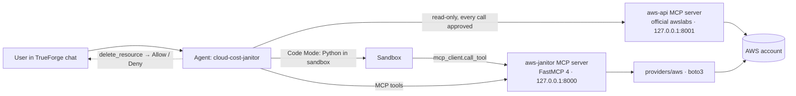

# Cloud Cost Janitor — Build Plan

An agent for the **Agents That Act** hackathon (TrueFoundry × Polaris, 26 Sep 2026) that finds idle
instances, orphaned volumes and forgotten load balancers in a real AWS account, prices the waste,
drafts a teardown plan, and deletes resources **only after a human clicks Allow** in TrueForge.

This file is the working plan. It is updated as steps complete (see *Progress* at the bottom).

---

## 1. Requirements (from the hackathon rules)

| Rule | How this project satisfies it | Where |
|---|---|---|
| Agent must run on **TrueForge** | Saved agent `cloud-cost-janitor` registered via the TrueForge API | `trueforge/` |
| Must **reach a real system** | AWS account via boto3 behind an MCP server; official AWS MCP server for ad-hoc reads | `providers/aws`, `trueforge/` |
| Generated code must **run in a sandbox** | Aggregation of findings is done in TrueForge **Code Mode** (Python in the sandbox, calling MCP tools through `mcp_client`) — a required step in the agent instructions so the trace shows `sandbox.created` + `exec` | agent instructions |
| **Stop for human approval** before irreversible actions | `delete_resource` is the only destructive tool; gated per-server with `require_approval_for_tools: ["@destructive","delete_resource"]` (verified: Deny blocks, Allow runs) | `server/`, `trueforge/agent.json` |
| Own credentials only; **no secrets in repo/video** | AWS identity named explicitly in `.env` (`AWS_PROFILE` or a key pair) — the server never falls back to whatever ambient credentials happen to be on the host; MCP bearer token from `.env` (git-ignored); `.omc/` ignored; no account ids in docs | `.gitignore`, `.env.example` |
| **Disclose AI tools** in README | Architecture designed by the author, refined and implemented with Claude Code; runtime model Kimi K3 via an OpenAI-compatible gateway, OpenAI swap instructions | `README.md` |

## 2. What was verified before building (Step 0 — done)

On the installed TrueForge v0.2.1 (local mode):
- After restarting with `OUTBOUND_URL_ALLOWED_HOSTS='["127.0.0.1","localhost"]'`, a FastMCP server on `http://127.0.0.1:8000/mcp` with bearer-header auth registers as a connector and its tools (with annotations) are listed.
- Code Mode works on the local sandbox: `from mcp_client import call_tool` reached the MCP server.
- Approval gate: turn pauses with `tool.approval_required`; Deny → tool not executed; Allow → executed.
- AWS IAM user has `ec2:Describe*`, `elasticloadbalancing:Describe*`, `cloudwatch:GetMetricStatistics`; **no** `pricing:GetProducts` (so pricing is a static table). Account has **no default VPC** in us-east-1.

## 3. Architecture



**Layers (provider-agnostic core, AWS-only implementation):**

| Layer | Responsibility | Knows about AWS? |
|---|---|---|
| `models` | `Resource` (instance/volume/load balancer), `Metrics`, `Finding`, `TeardownStep`, `TeardownPlan` | no |
| `providers/aws` | list resources + metrics, tag, snapshot, delete (boto3) | yes |
| `rules` | pure functions `Resource + Metrics -> Finding | None` with thresholds (Trusted Advisor defaults) | no |
| `pricing` | static list-price table → monthly USD estimate | no (data only) |
| `planner` | findings → ordered `TeardownPlan` with mandatory reversible first steps, `plan_id`, protection | no |
| `server` | FastMCP app + one `tools/*.py` per capability; bearer auth; append-only audit log | no (calls provider) |

**Detection rules (defaults from AWS Trusted Advisor):**
- *Idle instance*: running, daily CPU avg ≤ 10 % **and** daily NetworkIn+Out ≤ 5 MB on every observed day, lookback 14 d. Evidence includes days observed; `confidence` = high (≥ 4 days), medium (1–3), low (< 1 day). First hour after launch is excluded (boot spike). Stopped instances are reported separately (cost = EBS only).
- *Orphaned volume*: state `available` (no attachments).
- *Idle load balancer*: an application load balancer with 0 healthy targets is flagged unless its
  request count over the window is ≥ 100/day (a redirect-only listener or Lambda targets can serve real
  traffic with no healthy targets to show); with healthy targets, flagged if < 100 requests/day over 7 d
  (no datapoints ⇒ 0). Targets in state `unavailable`/`initial` count as healthy (not proven idle).
  Non-application load balancers have no request metric and are judged on healthy targets alone.
- *Protection*: tags `env=prod`, `Environment=Production`, `janitor:keep=true` ⇒ finding is reported but `protected=true`; teardown refuses.

**Teardown plan (planner):**
1. Order: instances → load balancers → volumes (children after the parent that used them).
2. Every stateful delete is preceded by a **reversible step**: snapshot the volume (or the instance's root volume) and tag the snapshot with source id + plan id.
3. Optional two-phase mode (Cloud Custodian's *mark-for-op*): `mark_for_teardown` tags resources `janitor:teardown-after=<date>`; deletion only allowed after that date. Reversible (untag) and not approval-gated. Default off for the demo, on in the README as the production mode.
4. `plan_id` (in-memory, 1 h TTL) must be presented to `delete_resource`; the server **re-describes the resource at delete time** and refuses if it is now attached / running when it was planned stopped (or vice versa) / has more healthy targets than planned / gained a protect tag / is gone. This re-check covers state and target health only, not load balancer traffic.

**Server env:** `COST_JANITOR_TOKEN` (bearer), the AWS identity (`AWS_PROFILE` or key pair, optional `AWS_ROLE_ARN`/`AWS_EXTERNAL_ID`), `AWS_REGIONS` (default `us-east-1`), `JANITOR_HOST`/`JANITOR_PORT`, `JANITOR_AUDIT_LOG`, `CLOUD_PROVIDER` (default `aws`). *(A server-side tag allowlist existed during the build and was removed: approval is TrueForge's job, and which resources may be deleted is the job of the IAM policy the operator puts on the identity named in `.env`. A blank `AWS_*` line in `.env` is now dropped from the environment before boto3 sees it, instead of being passed through as an empty string.)*

**MCP tools (aws-janitor), ten total, one destructive:**

| Tool | Annotations | Purpose |
|---|---|---|
| `list_regions()` | read-only | configured + available regions |
| `find_idle_instances(region, lookback_days=14)` | read-only | instances + metrics evidence + cost |
| `find_orphaned_volumes(region)` | read-only | unattached volumes + cost |
| `find_idle_load_balancers(region, lookback_days=7)` | read-only | LBs with no healthy targets / low traffic |
| `generate_cost_report(regions=None, instance_lookback_days=14, lb_lookback_days=7)` | read-only | full scan → `TeardownPlan` JSON with `plan_id`, totals, protected count |
| `get_plan(plan_id)` | read-only | re-fetch a live plan by id |
| `mark_for_teardown(resource_ids, region, plan_id, grace_days=7)` | write, reversible | tag resources in the plan (two-phase mode) |
| `unmark_teardown(resource_ids, region, plan_id)` | write, reversible | remove the teardown-after tag |
| `delete_resource(resource_type, resource_id, region, plan_id, wait_for_snapshot=False)` | **destructive** | re-verify → snapshot → delete; reaches the server only after the user's Allow |
| `get_actual_spend(days=30, group_by="service")` | read-only | real billed spend from Cost Explorer |

**Official AWS server (aws-api):** `uvx awslabs.aws-api-mcp-server==<pinned version>` (pinned in `scripts/run_mcp_servers.sh`, bumped deliberately) with `AWS_API_MCP_TRANSPORT=streamable-http`, `AWS_API_MCP_PORT=8001`, `READ_OPERATIONS_ONLY=true`, `AUTH_TYPE=no-auth` (loopback only). Attached to the agent with `enable_tools: ["call_aws","suggest_aws_commands"]` and `require_approval_for_tools: ["@all"]` (its single `call_aws` tool is unannotated, so gate everything).

**Agent (TrueForge):** model Kimi K3 (set via `MODEL=<provider/model>` at setup); sandbox on; `dynamic_sub_agents` off (sequential, stateful); `ask_user_questions` on; `generative_ui` on. Instructions: role + workflow (scan → aggregate in Code Mode → present plan with Generative UI → ask which resources → `delete_resource` **directly, one call per resource, never inside a script**).

## 4. Repository layout

```
cloud-cost-janitor/
├── AGENTS.md                 # root conventions (uv, tests, style, security)  + CLAUDE.md → @AGENTS.md
├── PLAN.md                   # this file
├── README.md
├── LICENSE                   # MIT
├── pyproject.toml  uv.lock  .python-version  .env.example  .gitignore
├── .github/workflows/ci.yml  # uv sync + pytest
├── src/cloud_cost_janitor/
│   ├── AGENTS.md
│   ├── models.py             # dataclasses, provider-agnostic
│   ├── pricing.py            # static list prices (us-east-1), estimate helpers
│   ├── config.py             # env settings (token, regions, AWS identity)
│   ├── providers/
│   │   ├── AGENTS.md
│   │   ├── base.py           # CloudProvider ABC
│   │   └── aws/
│   │       ├── AGENTS.md
│   │       ├── client.py     # boto3 session/clients per region
│   │       ├── ec2.py        # instances, volumes, snapshots
│   │       ├── elb.py        # elbv2 + target health + RequestCount
│   │       ├── metrics.py    # CloudWatch stats folded into daily figures
│   │       ├── prices.py     # live AWS Price List API lookups
│   │       ├── spend.py      # Cost Explorer
│   │       └── provider.py   # AwsProvider(CloudProvider)
│   ├── rules/
│   │   ├── AGENTS.md
│   │   ├── idle_instance.py  unattached_volume.py  idle_load_balancer.py  protection.py
│   ├── planner/
│   │   ├── AGENTS.md
│   │   └── plan.py           # build_plan(), ordering, reversible steps, plan registry (TTL)
│   └── server/
│       ├── AGENTS.md
│       ├── app.py            # FastMCP instance, auth, registers tools
│       ├── __main__.py       # `python -m cloud_cost_janitor.server`
│       └── tools/
│           ├── scan_tools.py  plan_tools.py  teardown_tools.py
├── tests/                    # mirrors src; moto for AWS; in-memory FastMCP Client for server
│   ├── AGENTS.md
│   ├── test_rules.py  test_pricing.py  test_planner.py
│   ├── providers/test_aws_*.py
│   └── server/test_tools.py  test_auth.py
├── trueforge/
│   ├── AGENTS.md
│   ├── agent.json            # agent manifest (both connectors, gates)
│   ├── connectors.json       # connector manifests (token injected from env at setup time)
│   └── setup.sh              # preflight + PUT connectors + POST/PUT agent
└── scripts/
    ├── AGENTS.md
    ├── run_mcp_servers.sh    # starts aws-janitor (:8000) and aws-api (:8001)
    ├── seed_demo.sh          # creates tagged demo waste (VPC, idle t3.micro, 2 volumes, empty ALB)
    ├── cleanup_demo.sh       # removes everything tagged janitor-demo=true, dependency order
    └── smoke_test.sh         # one turn against the saved agent via TrueForge API
```

Every directory has an `AGENTS.md` (purpose, rules for that directory, how to test) and a sibling
`CLAUDE.md` containing only `@AGENTS.md` (the convention used in the TrueForge repo itself).

## 5. Build steps (one at a time; each ends with its tests passing)

| # | Step | Done when |
|---|---|---|
| 1 | Skeleton: directories, all `AGENTS.md`/`CLAUDE.md`, `.gitignore` (+`.omc/`, `.env`), `.env.example`, LICENSE, CI file, first commit | `git status` clean, `uv run pytest` runs (0 tests) |
| 2 | `models.py`, `pricing.py`, `config.py` + tests | `test_pricing.py` green |
| 3 | `rules/` (pure) + tests with hand-built fixtures | `test_rules.py` green, thresholds documented |
| 4 | `providers/base.py` + `providers/aws/*` + moto tests (instances running/stopped, volumes, ALB + target health, snapshot, delete, tag guard) | `tests/providers` green |
| 5 | `planner/` + tests (ordering, reversible steps, plan registry TTL, protection refusal, re-verify) | `test_planner.py` green |
| 6 | `server/` (FastMCP app, auth, tools) + in-memory client tests (tools list + annotations, 401 without token, tool result shapes) | `tests/server` green; `tools/list` via inspector shows all ten tools |
| 7 | Seed demo resources in AWS (**user OK**), run server for real, verify findings against seeded ids | findings match seeded resources |
| 8 | Official `aws-api` server running read-only on :8001; `run_mcp_servers.sh` | `delete-*` command refused; `describe-*` works |
| 9 | `trueforge/` manifests + `setup.sh`; replace the step-0 `hello` connector | agent created (201) with gates visible in the response |
| 10 | End-to-end rehearsal + `smoke_test.sh`: audit → Code Mode aggregation → plan table → Deny → Allow (with `ALLOW_DELETE=true`) → volumes gone | TrueForge session shows `sandbox.created`, `exec`, `tool.approval_required` |
| 11 | README (problem, architecture, rule compliance, safety model, setup, demo script, limitations, extending to GCP/Azure, AI disclosure), secret scan, public repo (**user OK**) | CI green on GitHub |
| 12 | Optional: cost chart (Generative UI), weekly report schedule | — |

## 6. Known limitations (to state in README)
- Prices come from the live AWS Price List API when permitted, else the static us-east-1 on-demand list
  price table (no RI/Savings Plans, no LCU/data transfer either way).
- Classic ELB and GCP/Azure not implemented; `CloudProvider` ABC is the extension point.
- Plan registry is in-memory (server restart invalidates plan ids).
- Idle confidence is low for resources younger than a day (true for demo-seeded ones).
- The load balancer delete-time check re-reads state and target health only, not traffic.
- Auto Scaling group members are not excluded from idle-instance findings.

## 7. Progress
- [x] Step 0 — platform de-risk (allowlist, Code Mode, approval gate) verified 2026-09-26
- [x] Steps 1–6 — skeleton, models/pricing/config, rules, AWS provider, planner, MCP server (70 tests)
- [x] Step 7 — demo resources seeded in the personal account; scan finds ALB + 2 volumes ($18.03/mo)
- [x] Step 8 — official aws-api server read-only on :8001; delete refused by its policy
- [x] Step 9 — connectors + agent registered via `trueforge/setup.sh`; gates confirmed in the API response
- [x] Step 10 — full rehearsal through the agent: audit → Code Mode aggregation → Generative UI → question → Deny (nothing changed) → stale plan refused → fresh plan → Allow → snapshots + real deletion verified in AWS
- [x] Step 11 (docs) — README written, secret scan clean, disclosure worded; agent re-verified on Kimi K3
- [x] TrueForge skill `skills/cloud-cost-audit` written (playbook + reference aggregation script); `setup.sh` requires it and registers it from `SKILL_REPO_URL`/`SKILL_REF` (a pinned tag) — there is no fallback to inline instructions, so the repo must be public and the tag must exist
- [x] Published https://github.com/ayush22667/cloud-cost-janitor (CI green); skill attached via `SKILL_REPO_URL`; rehearsal with the skill loaded passed (needed Homebrew git for the macOS sandbox, documented in README)
- [ ] Step 12 — optional polish
