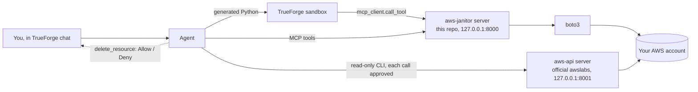

# Cloud Cost Janitor

Finds idle EC2 instances, unattached volumes and empty load balancers in your AWS account, works out
what they cost per month, and deletes them. It only deletes after you click Allow.

Built on [TrueForge](https://trueforge.dev), TrueFoundry's open-source agent harness, for the
*Agents That Act* hackathon (TrueFoundry x Polaris, September 2026).

```
you:    Audit us-east-1 for wasted cloud spend.
agent:  3 wasteful resources, $18.03/month: an ALB with no targets ($16.43), two unattached
        10 GB volumes ($0.80 each). Which should I tear down?   [All] [ALB only] [Volumes] [Nothing]
you:    Both volumes.
agent:  delete_resource(vol-...a)   [Allow] [Deny]
you:    Deny.
agent:  Denied. Not deleted, no snapshot taken.
you:    OK, go ahead.
agent:  delete_resource(vol-...a)   [Allow]
        Deleted. Restore point snap-0faee..., saving $0.80/month.
```

## Why

Every AWS account I have worked in had a few hundred dollars a month of forgotten resources:
volumes left behind by terminated instances, load balancers whose targets were deleted years ago,
test boxes nobody switched off. The finding part is easy. The hard part is deleting things without
someone getting paged at 2am, which is why nobody automates it.

So the agent does the boring work (scan, price, plan) on its own and stops at the one step that matters.

Every deletion is a separate approval, taken with a snapshot first, and checked again at the moment
of deletion in case something changed since the plan was made.

## How it works



Three processes run on your machine. TrueForge hosts the agent and the chat. The `aws-janitor` MCP
server (this repo) talks to AWS with boto3 and exposes ten tools, one of which is destructive.
The official [awslabs AWS API server](https://awslabs.github.io/mcp/servers/aws-api-mcp-server) runs in
read-only mode for ad-hoc questions like "what else is in that VPC".

An audit goes like this:

1. The agent calls `generate_cost_report`. The server lists instances, volumes and load balancers,
   pulls 14 days of CloudWatch data, applies the rules below, prices each finding and returns a plan
   with a `plan_id`.
2. The agent writes a short Python script and runs it in TrueForge's sandbox. The script calls the
   same tool through `mcp_client` and prints totals per type and confidence. The sandbox has no AWS
   credentials; its calls are bridged back to the server.
3. The agent shows the plan as a table and asks which resources to remove.
4. For each one you name it calls `delete_resource` once. TrueForge pauses for Allow or Deny.
5. On Allow, the server re-checks the resource, snapshots it, deletes it, and returns the snapshot id.

### Detection rules

The thresholds are AWS Trusted Advisor's, not mine.

| Finding | Rule |
|---|---|
| Idle instance | running, daily CPU at or under 10% and network at or under 5 MB on every observed day of a 14-day window (first hour after launch ignored) |
| Stopped instance | reported with its EBS cost only |
| Orphaned volume | state `available` |
| Idle load balancer | no healthy targets, or under 100 requests a day over 7 days |
| Protected | tagged `env=prod`, `Environment=Production` or `janitor:keep=true`; reported, never planned |

Each finding carries a `confidence`. A box launched this morning has three hours of data, so it is
flagged with low confidence rather than hidden.

### Repository layout

```
src/cloud_cost_janitor/
  models.py       resources, metrics, findings, plans
  pricing.py      PriceBook interface, static us-east-1 fallback table, monthly estimates
  config.py       settings from .env: token, regions, AWS identity
  providers/      CloudProvider interface; aws/ is the only place boto3 is imported
                  (EC2, EBS, ELBv2, CloudWatch, Price List API, Cost Explorer)
  rules/          pure functions: resource in, finding out
  planner/        ordered teardown plan, snapshot-first steps, plan registry, re-verification
  server/         FastMCP app: scan, plan and teardown tools, bearer auth
iam/              least-privilege policies and a cross-account CloudFormation template
trueforge/        agent.json, connectors.json, setup.sh
skills/           cloud-cost-audit, the TrueForge skill with the audit playbook
scripts/          run_mcp_servers.sh, seed_demo.sh, cleanup_demo.sh, smoke_test.sh
tests/            91 tests; AWS is mocked with moto, the MCP server is tested in-process
```

Each directory has an `AGENTS.md` with the rules for that directory.

## Quick start

You need Python 3.12, [uv](https://docs.astral.sh/uv/), Node 22 for TrueForge, and the AWS CLI.
On macOS you also need Homebrew's git (`brew install git`); TrueForge's sandbox cannot run Apple's
`/usr/bin/git` shim, and skills fail to clone without it.

```bash
git clone https://github.com/ayush22667/cloud-cost-janitor && cd cloud-cost-janitor
uv sync
cp .env.example .env    # set COST_JANITOR_TOKEN and the AWS identity, see below
uv run pytest           # no AWS needed
```

Start TrueForge with its outbound guard allowing loopback (it blocks `127.0.0.1` by default), add a
model under Settings > Models, then register everything:

```bash
OUTBOUND_URL_ALLOWED_HOSTS='["127.0.0.1","localhost"]' npx @truefoundry/trueforge     # terminal 1
scripts/run_mcp_servers.sh                                                             # terminal 2
SKILL_REPO_URL=https://github.com/ayush22667/cloud-cost-janitor MODEL=<provider/model> bash trueforge/setup.sh
```

`setup.sh` checks that TrueForge, the model and both servers are up, registers the two connectors and
the skill, and creates the agent. Open http://localhost:8790, go to Agents, and press Try.

`MODEL` is whatever name TrueForge shows under Settings > Models, for example `openai/gpt-5.2`. I
developed it on Kimi K3 behind an OpenAI-compatible gateway. Leave `SKILL_REPO_URL` out if you are
working from a private fork; the same steps are then registered as inline instructions.

## Configuration

Everything is read from `.env`. The server refuses to start if the token or the AWS identity is
missing, and it never logs which account it is talking to.

| Variable | Purpose |
|---|---|
| `COST_JANITOR_TOKEN` | bearer token TrueForge sends to the server (any random string) |
| `AWS_PROFILE` | named profile from `~/.aws`. Recommended on a laptop, ideally an SSO profile |
| `AWS_ACCESS_KEY_ID`, `AWS_SECRET_ACCESS_KEY`, `AWS_SESSION_TOKEN` | the alternative, for containers and CI |
| `AWS_ROLE_ARN`, `AWS_EXTERNAL_ID` | optional. Audit another account by assuming a role there |
| `AWS_REGIONS` | comma-separated, default `us-east-1` |
| `JANITOR_HOST`, `JANITOR_PORT` | default `127.0.0.1:8000` |

Set either a profile or a key pair, not both.

There is deliberately no fallback to whatever credentials happen to be on the machine.

### IAM

Two policies in `iam/` cover what the janitor needs. `janitor-read-policy.json` is the `Describe*`
and CloudWatch calls. `janitor-actions-policy.json` allows snapshot, tag and delete, but only on
resources carrying the tag `janitor-demo=true`. That condition is the real guard: the server has no
allowlist of its own, so there is nothing to misconfigure, and AWS refuses anything the agent asks for
outside it. Change the tag in the policy for your own use.

`janitor-demo-seed-policy.json` is only for the demo scripts. Remove it afterwards.

### Another account

The other account's owner deploys `iam/cross-account-role.yaml`. It creates a role with the two
policies above and a trust policy for your principal plus an External ID.

```bash
aws cloudformation deploy --stack-name cloud-cost-janitor --template-file iam/cross-account-role.yaml \
  --capabilities CAPABILITY_NAMED_IAM \
  --parameter-overrides JanitorPrincipalArn=arn:aws:iam::<your-account>:user/<you> ExternalId=<random-string>
```

Put the role ARN and the same string in `.env` as `AWS_ROLE_ARN` and `AWS_EXTERNAL_ID`. The server
assumes the role with STS and refreshes the temporary credentials itself. Deleting the stack revokes
access. No keys change hands.

## What stops it deleting the wrong thing

1. TrueForge pauses every `delete_resource` call for Allow or Deny. The server only sees approved calls.
2. A call needs a `plan_id` from a report less than an hour old. A server restart forgets all plans.
3. The resource is described again right before deletion and refused if it is now attached, running,
   has healthy targets, gained a protect tag, or is gone.
4. Volumes, and the volumes of an instance, are snapshotted first. The snapshot ids come back in the result.
5. IAM only permits deleting tagged resources (see above).
6. `mark_for_teardown` is an optional two-phase mode: tag now, delete after a grace period. It is
   Cloud Custodian's mark-for-op pattern.
7. The agent calls `delete_resource` once per resource and never from a script, so each deletion is
   its own approval.
8. The official AWS server runs with `READ_OPERATIONS_ONLY=true` and every one of its calls is
   approval-gated as well, because its single `call_aws` tool carries no annotations.

## Demo

```bash
scripts/seed_demo.sh          # about $0.04/hour: an idle t3.micro, two 10 GB volumes, an empty ALB
scripts/run_mcp_servers.sh
```

Then in the chat: "Audit us-east-1 for wasted cloud spend." Pick the volumes. Deny the first approval
and show the volume still exists in the console. Ask again, Allow, and show the snapshot and the
missing volume. TrueForge's Sessions page has the full trace, including the sandbox run and the
approval pause.

The same flow from a terminal: `scripts/smoke_test.sh new "Audit us-east-1..."`, then `answer`,
`approve deny`, `approve allow`. Clean up with `scripts/cleanup_demo.sh --snapshots`.

## Limitations

Prices come from the AWS Price List API for the region being scanned, cached for the life of the
process; if that API is not permitted, a table of us-east-1 list prices in `pricing.py` answers
instead and the `cost_note` says so. Either way the numbers are on-demand estimates: no Savings Plans,
no LCU charges, no data transfer. `get_actual_spend` reads real billed spend from Cost Explorer so
the two can be compared, but only after the account owner has enabled Cost Explorer and IAM access to
billing data; until then the tool explains what to enable.

Idle detection looks at CPU and network only. Classic ELBs are not covered. Only AWS is implemented;
`CloudProvider` in `providers/base.py` is the seam for GCP or Azure, and both publish MCP servers that
could take the `aws-api` role. Plans live in memory.

TrueForge's local sandbox can only reach PyPI and GitHub, which is why all AWS calls live in the
server and not in generated code.

## Hackathon notes

| Requirement | Where |
|---|---|
| Runs on TrueForge | `trueforge/agent.json`, registered by `setup.sh` |
| Reaches a real system | boto3 against the operator's own account, plus the official AWS MCP server |
| Generated code runs in a sandbox | the aggregation step; the trace shows `sandbox.created` and `exec` |
| Human approval before irreversible actions | `delete_resource` is gated by name and by its `destructiveHint` |
| Own credentials, nothing in the repo | identity named in `.env`, verified at startup, never logged |

The architecture (the cloud-agnostic core, an MCP server with one gated destructive tool, the agent
on top) is mine. I refined and built it with Claude Code, which checked the design against the
installed TrueForge and caught several API shapes I had wrong; `PLAN.md` has the list. Each step was
reviewed and run against a real account. The agent ran on Kimi K3 during development. No credentials
or account identifiers are in this repository.

## License

MIT. See [LICENSE](LICENSE).
