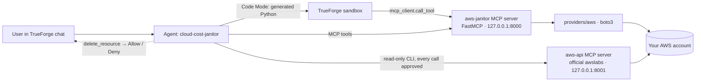

# Cloud Cost Janitor

An agent that finds idle instances, orphaned volumes and forgotten load balancers in a **real AWS
account**, prices the waste, drafts a teardown plan, and deletes resources **only after a human clicks
Allow** — built on [TrueForge](https://trueforge.dev), TrueFoundry's open-source agent harness, for the
*Agents That Act* hackathon (TrueFoundry × Polaris, 26 Sep 2026).

```
you:    Audit us-east-1 for wasted cloud spend.
agent:  3 wasteful resources, $18.03/month: an ALB with no targets ($16.43), two unattached
        10 GB volumes ($0.80 each). Which should I tear down?   [All] [ALB only] [Volumes] [Nothing]
you:    Both volumes.
agent:  → delete_resource(vol-…a)  ⏸ Allow / Deny
you:    Deny.
agent:  Denied — not deleted, no snapshot taken.
you:    OK, go ahead.
agent:  → delete_resource(vol-…a)  ⏸ Allow
        ✅ Deleted, restore point snap-0faee…, saving $0.80/month
```

## What it does

| Step | Who | Where it runs |
|---|---|---|
| Scan instances, volumes and load balancers; pull 14 days of CloudWatch utilisation | `aws-janitor` MCP server (this repo) | your laptop, via boto3 with your own AWS credentials |
| Decide what is waste (AWS Trusted Advisor thresholds) and price it | rules + pricing (this repo) | same server |
| Aggregate the findings into totals and a table | **Python generated by the agent, executed in TrueForge's sandbox** (Code Mode) | sandbox |
| Present the plan, ask which resources to remove | TrueForge agent (Generative UI + clarifying question) | TrueForge |
| Snapshot, re-verify, delete | `delete_resource` — the only destructive tool, **approval-gated** by name | server, after the user clicks Allow |
| Answer ad-hoc questions about the account | official [awslabs AWS API MCP server](https://awslabs.github.io/mcp/servers/aws-api-mcp-server), read-only mode, every call approved | second connector |

## Architecture



The core is provider-agnostic. Only `providers/aws/` imports boto3; everything else works with the
dataclasses in `models.py`.

```
src/cloud_cost_janitor/
├── models.py      resources, metrics, findings, plans (JSON-serialisable)
├── pricing.py     static on-demand list prices (us-east-1) → monthly estimates
├── config.py      env settings: token, regions, ALLOW_DELETE, DELETE_ONLY_TAGGED
├── providers/     CloudProvider interface · aws/ (EC2, EBS, ELBv2, CloudWatch)
├── rules/         pure detection rules with Trusted Advisor thresholds
├── planner/       ordered teardown plan, snapshot-first steps, plan_id registry, re-verification
└── server/        FastMCP app: scan · plan · teardown tools, bearer auth
trueforge/         agent.json, connectors.json, setup.sh (registers everything in TrueForge)
scripts/           run_mcp_servers.sh · seed_demo.sh · cleanup_demo.sh · smoke_test.sh
tests/             70 tests: rules, pricing, planner, moto-backed AWS adapter, in-memory MCP client, HTTP auth
```

Every directory has an `AGENTS.md` describing its rules (with a `CLAUDE.md` that points to it).

## How the hackathon requirements are met

| Requirement | How |
|---|---|
| Runs on TrueForge | `trueforge/agent.json` is registered as a saved agent; all reasoning, sandboxing and approvals happen in TrueForge |
| Reaches a real system | boto3 against the operator's own AWS account (instances, volumes, load balancers, CloudWatch), plus AWS's official MCP server |
| Generated code runs in a sandbox | The agent's instructions require an aggregation step written in Python and executed in the TrueForge sandbox; the session trace shows `sandbox.created` and `exec`. The sandbox never holds cloud credentials: its script reaches AWS only through `mcp_client.call_tool`, which is bridged back to the harness |
| Stops for human approval before irreversible actions | `delete_resource` is annotated `destructiveHint` **and** listed by name in `require_approval_for_tools`; TrueForge pauses the turn with Allow / Deny. Verified: Deny leaves the resource untouched, Allow deletes it |
| Own credentials only, no secrets in the repo | AWS credentials come from `~/.aws`; the MCP bearer token lives in `.env` (git-ignored); connector manifests use `${COST_JANITOR_TOKEN}` placeholders |

## Safety model

The approval gate is necessary but not sufficient, so the server defends itself too:

1. **Dry-run by default.** `ALLOW_DELETE` must be `true` or `delete_resource` only reports what it *would* do (`"dry_run": true`).
2. **Plan required.** Deletion needs a `plan_id` from `generate_cost_report`; plans expire after one hour and a server restart forgets them. A stale plan is refused with "run generate_cost_report again".
3. **Re-verification at delete time.** The resource is described again and refused if it is now attached, running, has healthy targets, gained a protect tag, or no longer exists.
4. **Protected tags.** `env=prod`, `Environment=Production`, `janitor:keep=true` are reported but never planned.
5. **Tag guard.** `DELETE_ONLY_TAGGED=janitor-demo=true` restricts deletion to resources carrying that tag — recommended for demos.
6. **Reversible first step.** Volumes (and an instance's volumes) are snapshotted before deletion; snapshot ids are returned.
7. **Optional two-phase mode.** `mark_for_teardown` tags resources with `janitor:teardown-after=<date>`; `delete_resource` refuses them until then (Cloud Custodian's *mark-for-op* pattern).
8. **One resource per call, never from a script.** The agent is instructed to call `delete_resource` directly so every deletion is an individual approval.
9. **The official AWS server is read-only** (`READ_OPERATIONS_ONLY=true`) *and* gated on every call, because its single `call_aws` tool is unannotated.

Detection thresholds follow AWS Trusted Advisor: idle instance = daily CPU ≤ 10 % and network ≤ 5 MB
on every observed day (14-day window, boot hour excluded); idle load balancer = no healthy targets or
< 100 requests/day over 7 days; orphaned volume = state `available`. Findings carry a `confidence`
that reflects how many days of data exist, so a resource created this morning is flagged honestly.

## Setup

Prerequisites: Python 3.12+, [uv](https://docs.astral.sh/uv/), Node 22+ (for TrueForge), the AWS CLI
configured with credentials for **your own** account (`ec2:Describe*`, `elasticloadbalancing:Describe*`,
`cloudwatch:GetMetricStatistics`; plus `ec2:CreateSnapshot`, `ec2:DeleteVolume`, `ec2:TerminateInstances`,
`elasticloadbalancing:DeleteLoadBalancer` for live mode).

```bash
git clone https://github.com/ayush22667/cloud-cost-janitor && cd cloud-cost-janitor
uv sync
cp .env.example .env            # then set COST_JANITOR_TOKEN to a random string
uv run pytest                   # 70 tests, no AWS needed
```

Start TrueForge with its outbound guard allowing loopback (it blocks `127.0.0.1` by default), add a
model provider under **Settings → Models**, then:

```bash
OUTBOUND_URL_ALLOWED_HOSTS='["127.0.0.1","localhost"]' npx @truefoundry/trueforge   # terminal 1
scripts/run_mcp_servers.sh                                                           # terminal 2
MODEL=<provider/model> bash trueforge/setup.sh                                       # registers connectors + agent
```

`setup.sh` checks TrueForge, the model, and both servers, then creates (or updates) the agent
**cloud-cost-janitor**. Open `http://localhost:8790 → Agents → cloud-cost-janitor → Try`.

The agent was developed on Kimi K3 through an OpenAI-compatible gateway; any model configured in
TrueForge works — set `MODEL=<provider/model>` to the name TrueForge shows under Settings → Models
(for example `MODEL=openai/gpt-5.2` after adding an OpenAI provider).

## Demo

```bash
scripts/seed_demo.sh                       # ~$0.04/h: idle t3.micro, 2 unattached volumes, empty ALB (all tagged janitor-demo=true)
ALLOW_DELETE=true scripts/run_mcp_servers.sh   # live mode, still limited to tagged resources
```

In the chat: *"Audit us-east-1 for wasted cloud spend."* → plan table → pick *Both volumes* →
**Deny** the first approval and show the volume still exists → ask again → **Allow** → show the
snapshot and the deleted volume in the AWS console. **Sessions** in TrueForge shows the full trace.
The same flow scripted: `scripts/smoke_test.sh new "Audit us-east-1 …"`, then `answer`, `approve deny`,
`approve allow`.

Afterwards: `scripts/cleanup_demo.sh --snapshots`.

## Limitations

- Prices are us-east-1 on-demand list prices (no Savings Plans/RIs, no LCU or data transfer); the IAM
  user used here is not allowed to call the Pricing API. Other regions are flagged "approx".
- Instance idle detection uses CPU and network only (no memory); a resource younger than a day gets low confidence.
- Classic ELBs, GCP and Azure are not implemented. Plans are in-memory.
- TrueForge's local sandbox only allows network access to PyPI and GitHub, which is why AWS calls live in the MCP server.

## Extending to another cloud

Implement `CloudProvider` (`src/cloud_cost_janitor/providers/base.py`) in a new package, e.g.
`providers/gcp/`, return `Instance`/`Volume`/`LoadBalancer` objects with `UtilisationMetrics`, add its
prices to `pricing.py`, and select it with `CLOUD_PROVIDER=gcp`. Rules, planner and server need no changes.
Google Cloud and Azure both publish official MCP servers that could play the `aws-api` role.

## AI assistance disclosure

The initial architecture — the theme, the cloud-agnostic core with an AWS provider, the MCP server with a
single approval-gated `delete_resource`, and the TrueForge agent on top — was designed by the author.
That design was then refined with **Claude Code** (Anthropic), which checked it against the installed
TrueForge, corrected the parts that did not match its real API (see `PLAN.md`), and was used to write the
code, tests, scripts and documentation step by step, each step reviewed by the author and run against the
real account. The agent itself ran on Kimi K3 through an OpenAI-compatible gateway during development. No credentials or account identifiers are included in this repository.

## License

MIT — see [LICENSE](LICENSE).
