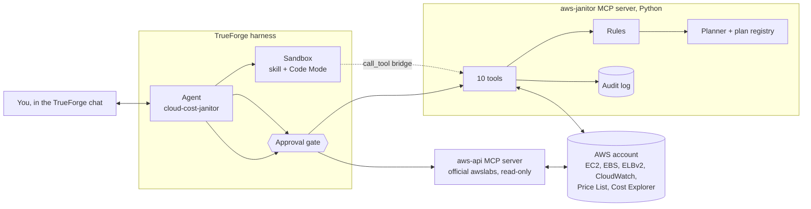
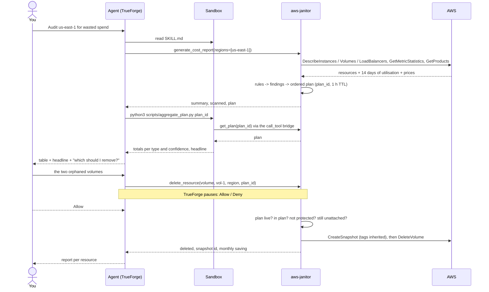
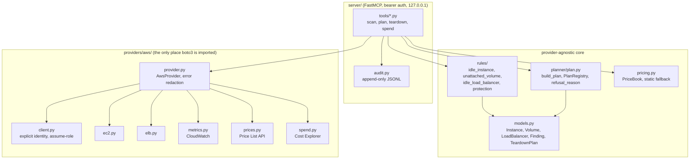
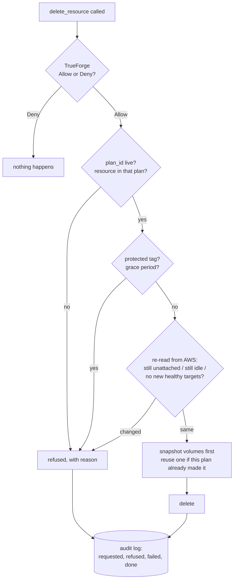
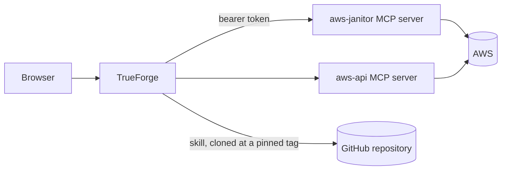

# Cloud Cost Janitor: how it works

## The problem

Every AWS account collects leftovers. An instance nobody has logged into for weeks. EBS volumes that
outlived the server they were attached to. A load balancer with nothing behind it. Each one costs a few
dollars a month, so nobody bothers, and they bill forever.

Cleaning them up by hand means opening three consoles, reading CloudWatch graphs, working out what each
thing costs, and then deleting it while hoping it really was unused. Cloud Cost Janitor does the finding,
the pricing and the plan. A person still does the deciding.

## The three pieces

**TrueForge** is the harness. It runs the agent loop, provisions the sandbox, renders the chat, and owns
the approval prompts. The agent is a saved definition (`trueforge/agent.json`): a short system prompt,
two MCP connectors with their approval rules, one skill, and the runtime switches.

**The aws-janitor server** is this repository's code: a FastMCP server that talks to one AWS account with
the identity named in `.env`. It scans, applies the idle rules, prices findings, builds a teardown plan,
and deletes through a single approval-gated tool.

**The skill** is the playbook the agent follows (`skills/cloud-cost-audit/SKILL.md`). TrueForge clones it
into the sandbox at a pinned tag. It also carries the script the agent runs to total a plan.

The second connector, **aws-api**, is the official awslabs server in read-only mode. It exists for
ad-hoc questions ("what else is in that VPC?") and every call to it pauses for approval.

## What the agent is versus what the skill is

| | Agent definition | Skill |
|---|---|---|
| Holds | role, model, connectors, approval rules, runtime toggles | the seven-step procedure, the response table, the aggregation script, three eval scenarios |
| Size | a few sentences | about 120 lines plus a script |
| In context | every turn | name and description every turn; the body only when the agent decides the task is an audit |
| Changes | rarely | versioned in git, pinned by tag in `trueforge/setup.sh` |

TrueForge's own guidance is to keep the prompt to role and behaviour and to move playbooks into skills.
The split also solves a practical problem: a prompt cannot carry a script, and the sandbox is where the
plan totals get computed.

## The tools

Nine tools are read-only. One is destructive. The annotations are what TrueForge's approval selectors
match on, and `delete_resource` is also named explicitly so that a dropped annotation could not silence
the gate.

| Tool | What it does | Annotation | Pauses for approval |
|---|---|---|---|
| `list_regions` | regions the identity can see | read-only | no |
| `find_idle_instances(region, lookback_days=14)` | running instances under the CPU and network thresholds; stopped instances | read-only | no |
| `find_orphaned_volumes(region)` | EBS volumes attached to nothing | read-only | no |
| `find_idle_load_balancers(region, lookback_days=7)` | load balancers with no healthy targets or under 100 requests a day | read-only | no |
| `generate_cost_report(regions?, instance_lookback_days?, lb_lookback_days?)` | one scan, priced, with an ordered plan and a `plan_id` | read-only | no |
| `get_plan(plan_id)` | the plan again, without rescanning | read-only | no |
| `get_actual_spend(days=30, group_by=service)` | real spend from Cost Explorer | read-only | no |
| `mark_for_teardown(resource_ids, region, plan_id, grace_days=7)` | tag resources with a future teardown date | write, reversible | yes (`@write`) |
| `unmark_teardown(resource_ids, region, plan_id)` | remove that tag | write, reversible | yes (`@write`) |
| `delete_resource(resource_type, resource_id, region, plan_id, wait_for_snapshot=False)` | snapshot, re-verify, delete | destructive | yes (`@destructive` and by name) |

## An audit, end to end

Three points in that flow matter more than the rest.

**One scan, one plan.** `generate_cost_report` is called once per audit. The plan it returns has an id
and lives for an hour in the server's memory. Everything after that, including the deletion, refers to
that id. A second scan would produce a second id and invalidate the first, which is why the skill forbids
it and why `get_plan` exists.

**Totals come from code.** The agent runs a script in the sandbox that fetches the plan through the
Code Mode bridge and prints the totals. Only the printed lines enter the model's context. The sandbox
never holds AWS credentials; the bridge calls the server, and the server holds the identity.

**The plan is the reply, the question is text.** TrueForge treats text sent alongside a tool call as a
step, not as the answer. The skill therefore makes the plan the final message of the turn and asks what
to remove in plain text. The structured question tool is reserved for a later turn when the answer is
ambiguous.

## Inside the server

The core never imports boto3. Rules are pure functions: a resource in, a finding or nothing out. The
planner orders findings so that reversible steps come first and marks which ones need a snapshot. The
AWS package is the only thing that knows what an ARN looks like.

### The rules

They follow AWS Trusted Advisor's definitions so that "idle" means something a reader can check.

| Rule | Flags | Confidence |
|---|---|---|
| Idle instance | running, CPU average at or under 10% and network at or under 5 MB a day on every observed day of the window; the first hour after boot is excluded | high with 14 observed days, medium with at least 24 hours, low below that |
| Stopped instance | any stopped instance; its disks are still billed | high |
| Orphaned volume | state `available`, attached to nothing | high |
| Idle load balancer | no healthy targets, or under 100 requests a day; a load balancer at or above 100 requests a day is never flagged, whatever its target health, because redirect listeners and Lambda targets serve traffic with no healthy target | by history, as above |

A resource carrying a protected tag (`env=prod`, `Environment=Production`, `janitor:keep=true`, case-insensitive) is still reported, marked protected, and never planned for teardown.

### Pricing

On-demand prices come from the AWS Price List API at scan time and are cached for the process. If the
identity lacks `pricing:GetProducts`, a small static table for us-east-1 takes over and the finding's
`cost_note` says so. Load balancer costs are the hourly charge only. Every figure is labelled an estimate.

## What stops it deleting the wrong thing

The checks are layered on purpose.

1. **The human gate is TrueForge's.** The server cannot bypass it, and a script in the sandbox cannot
   either: the Code Mode bridge refuses tools that are not read-only.
2. **The plan is the contract.** A deletion must name a resource that is in a plan the user has seen,
   and the plan expires after an hour. Plans are kept in memory rather than a database so that a
   restart forgets them and nothing can be replayed later.
3. **The server re-reads before acting.** State can change between the plan and the click. A volume
   that got attached, an instance that stopped, a load balancer that gained targets: all refused.
4. **Snapshot first, then delete.** Snapshots inherit the resource's tags plus the plan id, so cleanup
   can find them and the restore point is traceable to the decision. If the delete fails after the
   snapshot, the response still carries the snapshot ids.
5. **Denials are terminal.** The agent is told never to retry or work around a Deny or a refusal.
6. **Text from AWS is data.** Resource names and tags reach the model as data, and the agent is told
   they are never instructions.

What the identity may touch at all is decided by the IAM policy on the user or role named in `.env`.
The repository does not ship policies; it expects a least-privilege identity that can describe, and can
snapshot and delete only resources carrying a tag you choose.

## Identity and secrets

The AWS identity is named explicitly: a profile or a key pair in `.env`, optionally a role in another
account assumed with an External ID. There is no fallback to whatever credentials the host happens to
have, and blank `AWS_*` lines are treated as unset so boto3 never sees them. The server prints nothing
about who it is, not the account, the principal or a key id.

AWS's own error messages name the caller. They are redacted before the model sees them: an IAM refusal
becomes `AWS UnauthorizedOperation: IAM denied DeleteVolume`, and ARNs or account ids in other messages
are replaced. Load balancer ids are the ARN suffix (`app/<name>/<hash>`) for the same reason.

The audit log (`janitor-audit.jsonl`, git-ignored) records plans, requests, refusals with reasons,
failures and deletions with snapshot ids. It never holds identity or credentials.

## Runtime layout on one machine

